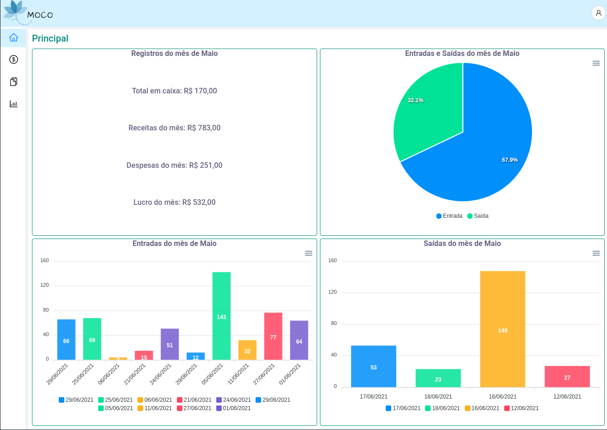
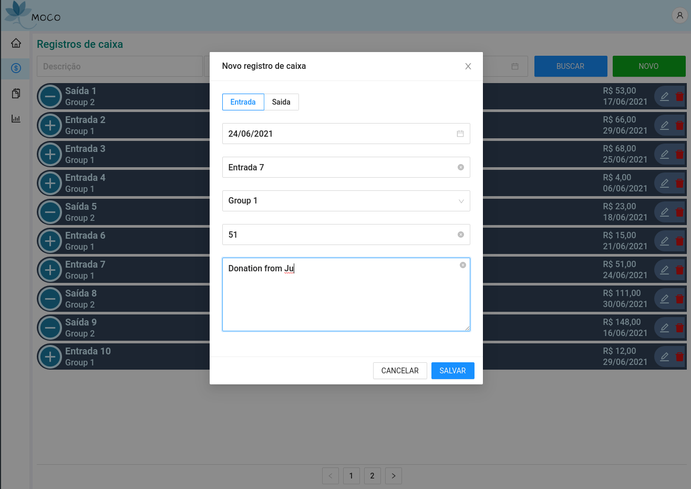
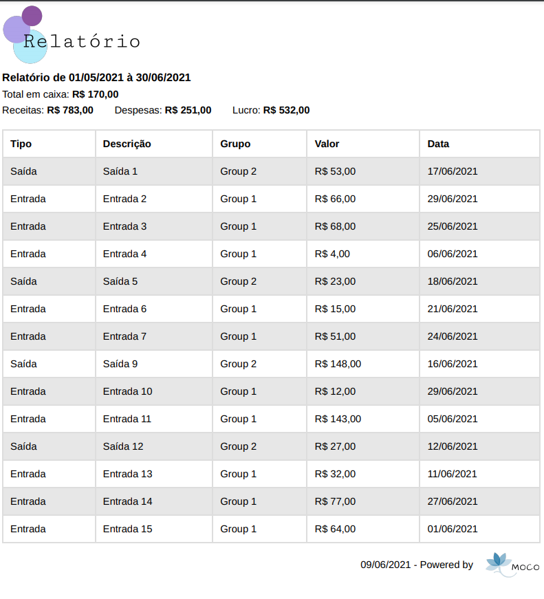

# MOCO
Este é o front ([Backend] aqui) de um projeto que tem o objetivo de atender necessidades no controle de caixa, como cadastrar, listar e gerar relatório sobre movimentação em períodos específicos. Este front foi construído utilzando [Next.js] e [Typescript].

## Apresentação
Abaixo algumas telas do projeto.





## Requisitos
- [Node.js] - Node.js na versão 14 ou superior;
- [Backend] - É necessário ter em execução a API deste projeto;

## Instalação
Após clonar este projeto, crie um arquivo chamado **.env** no diretório raíz, usando como referência o arquivo .env.example localizado no diretório citado. Em seguinda, em seu terminal de comandos, execute *npm install* para instalas as dependências e em seguida, *npm run dev* para que o projeto seja executado.

## Utilização
É possíve acessar o projeto em execução atráves do endereço **http://localhost:3000** e, considerando que seguiu os passos iniciais para execução do [Backend], pode efetuar o login com as informações abaixo:

```json
{
    "user": "admmaster",
    "password": "1234"
}
```

## Contato
welingtonfidelis@gmail.com
<br>
Sugestões e pull requests são sempre bem vindos 🤓 

License
----

MIT

**Free Software, Hell Yeah!**

[GitHub_API]: <https://docs.github.com/en/rest>
[Node.js]: <https://nodejs.org/en/>
[TypeScript]: <https://www.typescriptlang.org/>
[Next.js]: <https://nextjs.org/>
[Backend]: <https://github.com/welingtonfidelis/moco_api>
